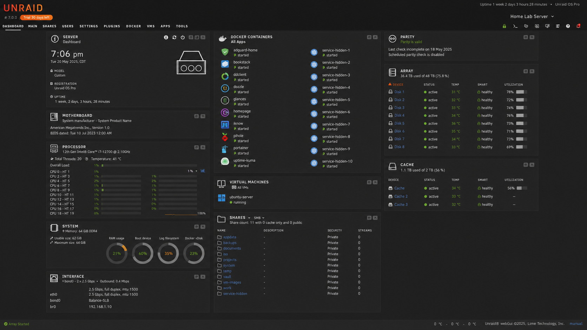
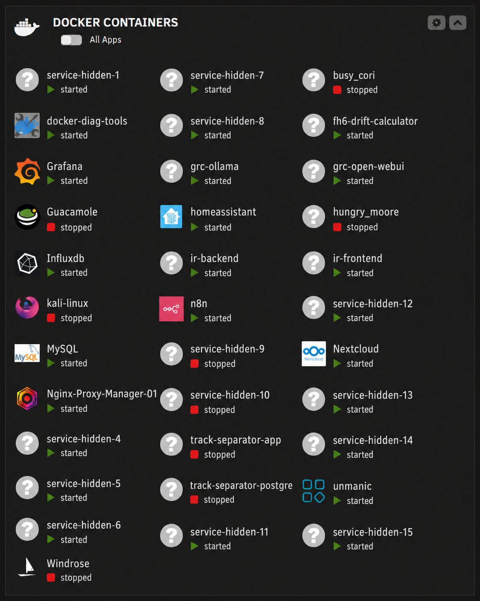
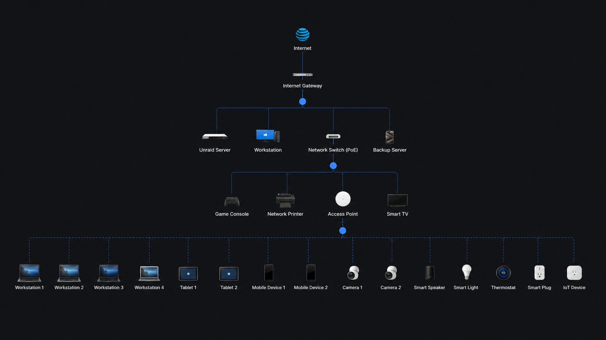

# Home Lab Operations

## Summary

My home lab is a self-hosted technical environment used to build, test, monitor, troubleshoot, and document infrastructure, cybersecurity, automation, and application projects.

It functions as a practical training ground for IT operations, self-hosting, container management, monitoring, workflow automation, and security visibility.

## Problem

Hands-on technical growth requires a place to experiment. Reading documentation is useful, but real understanding comes from deploying services, breaking configurations, troubleshooting failures, and rebuilding systems.

A home lab provides that environment.

## Approach

The lab is built around practical operations:

1. Run services in containers.
2. Track ports, volumes, and app data.
3. Monitor health and availability.
4. Use automation to reduce manual checks.
5. Document troubleshooting steps.
6. Keep public exposure intentional and reviewed.
7. Use projects to build career-relevant skills.

## Tools and Concepts

- Unraid
- Docker containers
- Ubiquiti networking
- Cloudflare DNS
- Reverse proxy concepts
- Grafana dashboards
- n8n automation
- Security Onion lab
- Home Assistant
- Local AI experiments
- Technical documentation

## Visual Evidence

### Unraid Server Dashboard

This dashboard shows the core server environment, including system health, array/cache status, container operations, virtual machines, and share organization.

### Docker Container Operations

This view shows the containerized service layer used to run lab tools, automation services, dashboards, development projects, and supporting applications.

### Network Topology

This sanitized topology view shows the general structure of the home lab network, including the internet gateway, server, switch, access point, wired devices, wireless clients, and IoT-style endpoints.

## What This Demonstrates

- Infrastructure ownership
- Container operations
- Network service awareness
- Monitoring and alerting discipline
- Troubleshooting ability
- Security-minded self-hosting
- Documentation and rebuild planning
- Self-directed technical development

## Outcome

The lab gives me a working environment to practice real technical operations. It supports multiple projects across automation, security monitoring, local AI, GRC experimentation, web apps, and infrastructure documentation.

## Public Safety Notes

Screenshots on this page are sanitized for public viewing. Private services, media-related services, personal device names, private hostnames, and sensitive network details are removed or generalized.
