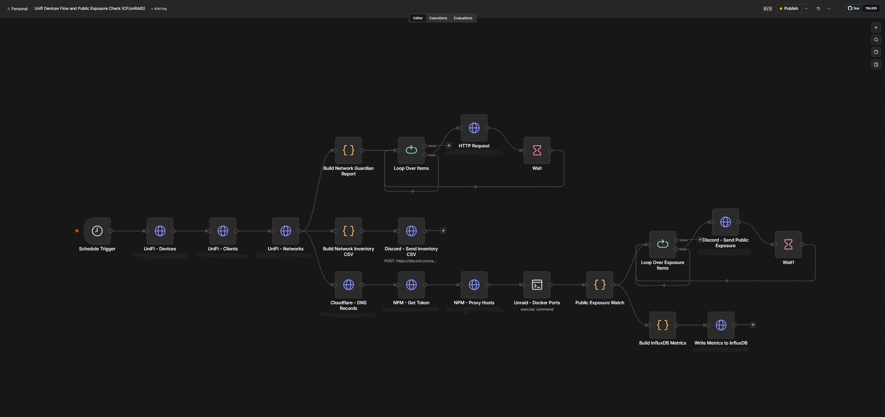
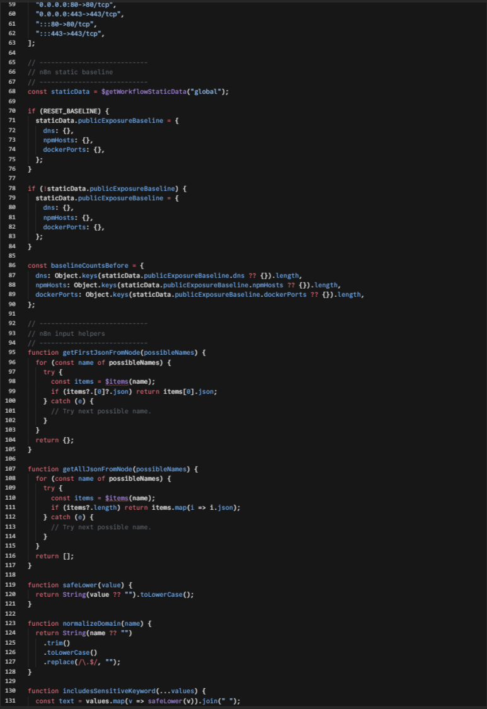
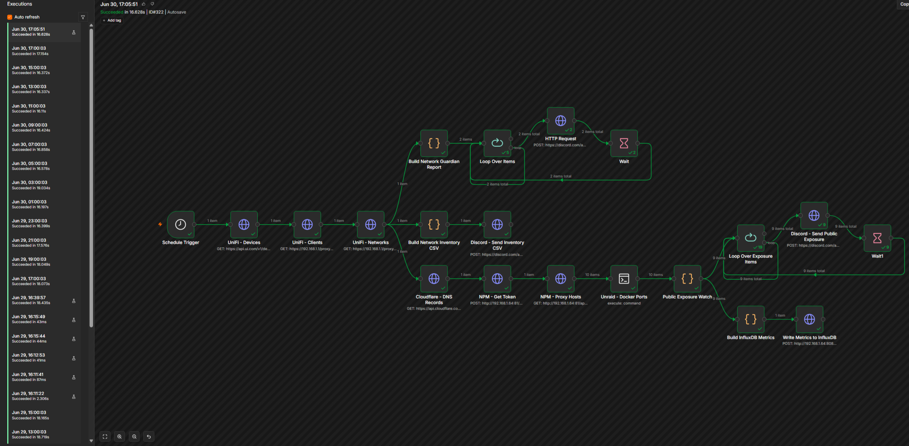
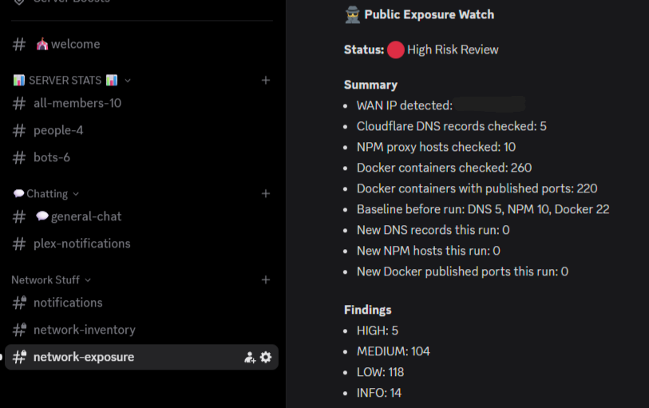

# n8n + Discord Automation

## Summary

This project uses **n8n** as a workflow automation engine and **Discord** as a notification layer for home lab operations, network visibility, and recurring status checks.

The workflow collects data from multiple sources, normalizes it, checks for meaningful changes, sends reports to Discord, and writes selected metrics for dashboarding.

## Problem

A growing home lab creates a lot of things to check manually:

- Are important services still running?
- Are any public-facing services unexpectedly exposed?
- Did DNS or reverse proxy records change?
- Are containers publishing ports that need review?
- Can useful status reports be delivered without logging into every tool?

Manual checks work for a small setup, but they do not scale well. This workflow creates a lightweight automation pipeline that checks the environment on a schedule and sends readable outputs to the right Discord channels.

## Approach

The workflow uses scheduled execution and multiple data sources to build a practical network operations report.

At a high level, the workflow:

1. Runs on a schedule.
2. Pulls device, client, and network data.
3. Queries DNS and reverse proxy information.
4. Checks Docker/container port exposure.
5. Builds network inventory output.
6. Reviews public exposure conditions.
7. Sends Discord notifications.
8. Writes selected metrics for dashboarding.

## Tools Used

- n8n
- Discord webhooks
- JavaScript function nodes
- Cloudflare DNS data
- Reverse proxy data
- Docker/container data
- Unraid home lab environment
- Metrics output for dashboarding

## Workflow Overview

The full workflow connects scheduled checks, network inventory, exposure review, Discord reporting, and metric output.

## Public Exposure Logic

The workflow includes a JavaScript function node that normalizes DNS records, reverse proxy hosts, and Docker-published ports. It compares observed data against a stored baseline so that new exposure-related changes can be surfaced.

## Execution History

The workflow runs on a recurring schedule and maintains execution history so failures, long runtimes, and repeated successful checks can be reviewed.

## Discord Alert Output

Discord is used as the human-readable output layer. This makes the workflow useful without needing to log directly into n8n every time a check runs.

## What This Demonstrates

- Scheduled automation workflows
- API and service integration
- JavaScript-based data normalization
- Discord-based operational reporting
- Baseline comparison logic
- Public exposure review
- Home lab monitoring discipline
- Clear technical documentation

## Outcome

The workflow creates a repeatable network operations check that runs without manual effort and sends useful results to Discord. It also turns scattered home lab data into a structured report that can be reviewed quickly.

## Lessons Learned

- Useful automation needs clean output, not just successful execution.
- Alerts should be separated by purpose so they do not become noise.
- Public exposure checks need baselines, otherwise every run looks important.
- Discord works well as a lightweight operations notification layer.
- A visual workflow is easier to explain when each branch has a clear job.
